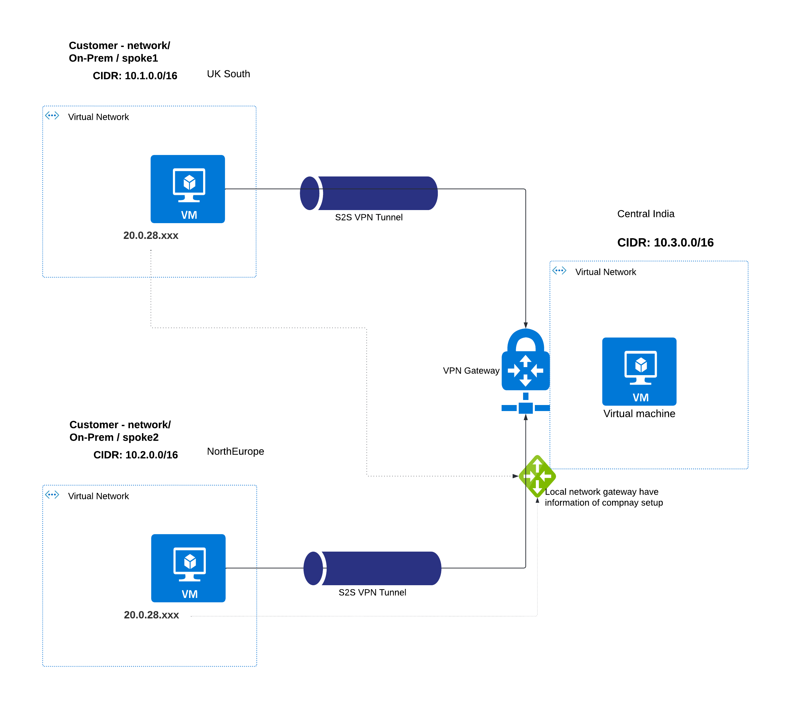

# Azure-site-to-site
# Network diagram

## Prerequsites
- [terraform](https://developer.hashicorp.com/terraform/tutorials/aws-get-started/install-cli)
- [azure cli](https://learn.microsoft.com/en-us/cli/azure/install-azure-cli)

This repo contains two spoke accounts (simulated on-prem network) with respective parameters.
- spoke1 ([spoke1-Vnet.azcli](./On-prem/spoke1-Vnet.azcli))
- spoke2 ([spoke1-Vnet.azcli](./On-prem/spoke1-Vnet.azcli))

change below parameters acc to your needs or keep default.
```
  resource_group_location = "centralindia"
  vnet_cidr = "10.6.0.0/16"
  public_subnet_address = "10.6.1.0/24"
  private_subnet_address = "10.6.2.0/24"
  gateway_subnet_address = "10.6.3.0/24"
  # Simulated on-prem details
  spoke1cidr = "10.1.0.0/16" 
  spoke2cidr = "10.2.0.0/16"
  spoke1_Vm_pip = "87.49.45.xxx" 
  spoke2_Vm_pip = "87.49.45.xx"
```
1. execute the spokes in terminal (copy and paste):
   -  ./spoke1-Vnet.azcli
   -  ./spoke2-Vnet.azcli

2. From spokes Vnets. **Copy** the public **public ip's** of both VM's. You get as output after execution.
3. These ip's are required for VPN setup
4. execute below cmds: (If you are in root dir: site-to-site-terrafrom)
   - terraform init or terraform init -upgrade
   - terraform plan
   - terraform apply


